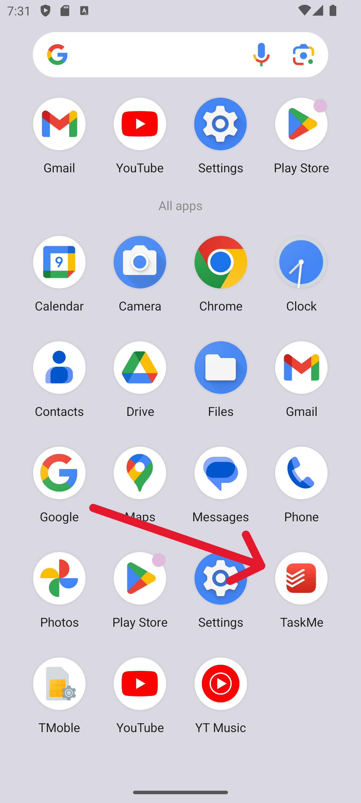
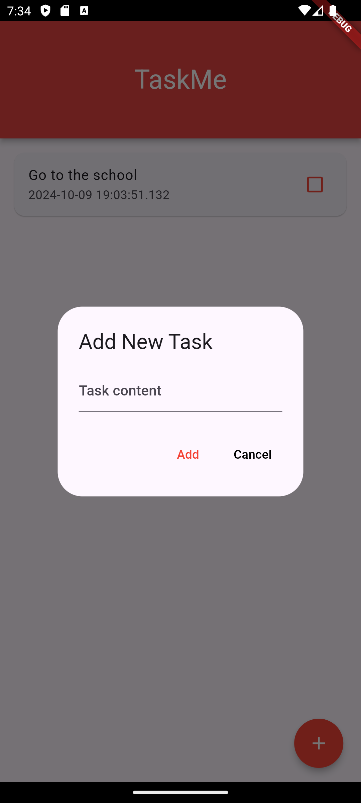
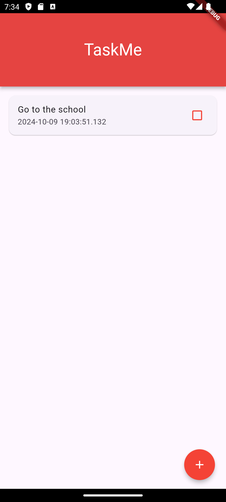

# TaskMe
🚀 **TaskMe** is a simple task management application built with Flutter. It allows users to add, complete, and delete tasks. The app uses the Hive database for local storage.

## ✨ Features

- **➕ Add Tasks**: Users can add new tasks using a popup dialog.
- **✔️ Complete Tasks**: Users can mark tasks as completed by tapping on them.
- **🗑️ Delete Tasks**: Users can delete tasks by long-pressing on them.
- **💾 Persistent Storage**: Tasks are stored locally using the Hive database.
- **📱 Responsive UI**: The app is designed to be responsive and works on various screen sizes.

## 📦 Packages Used

- **flutter**: The core Flutter framework.
- **hive**: A lightweight and fast key-value database written in pure Dart.
- **hive_flutter**: Extensions for Hive to work seamlessly with Flutter.

## 🚀 Getting Started

To get started with TaskMe, follow these steps:

1. **Clone the repository**:
  ```sh
  git clone https://github.com/Yasitha-Bhanuka/TaskMe-Flutter-App.git
  cd taskme
  ```

2. **Install dependencies**:
  ```sh
  flutter pub get
  ```

3. **Run the app**:
  ```sh
  flutter run
  ```

## 🗂️ Project Structure

The project is structured as follows:

```
taskme/
├── lib/
│   ├── main.dart
│   ├── models/
│   └── pages/
├── pubspec.yaml
└── README.md
```

## 📸 Screenshots

Here are some screenshots of the TaskMe app:

### 🖼️ App Icon


### ➕ Add Screen


### 🌊 Splash Screen


### 📋 Task Screen
